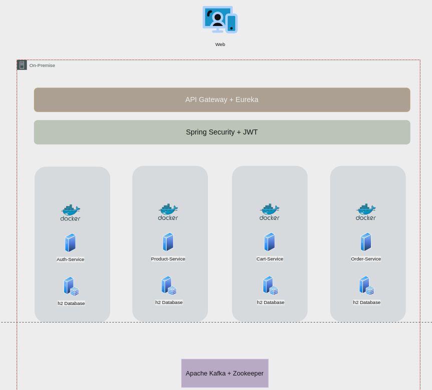

# Tech Challenge Fase 5
## Projeto do curso de Pós-Graduação da FIAP

## Grupo 50

- [Daniel Santiago](https://github.com/SantiagoDDaniel)
- [Kassiane Silva Mentz](https://github.com/kassimentz)
- [Leandro Paulino Costa](https://github.com/LeandroPC)
- [Luiz Felipe da Silva Santos](https://github.com/Felipe-3191)
- [Vitor Hugo Campos Alves](https://github.com/vitorAlves1992/)


## Fase 5 (03/01/2024 até 25/03/2024)


**Objetivos**

 Neste desafio, vamos desenvolver um sistema de e-commerce que permita aos usuários realizarem as seguintes operações:

 * **Login e Registro de Usuário**: Os usuários devem ser capazes de se cadastrar e fazer login no sistema usando as ferramentas do Spring Security para autenticação e autorização.
 * **Gestão de Itens**: Os usuários administradores terão acesso a uma tela de gestão de itens, basicamente o controle de cadastro e manutenção de itens, bem como seus preços.
 * **Carrinho de Compras**: Os usuários podem adicionar e remover itens do carrinho de compras. O carrinho de compras deve ser persistente e associado ao usuário logado.
 * **Pagamentos (Simulação)**: Implementar uma tela que simule o processo de pagamento, onde os usuários possam visualizar os itens do carrinho e concluir uma compra fictícia. Não é necessário integrar com formas de pagamento reais, apenas uma simulação.


### Requisitos Técnicos 
* Utilize o framework Spring Boot para criar o sistema.
* Utilize o Spring Security para implementar o controle de autenticação e autorização.
* Implemente a arquitetura de microsserviços para as funcionalidades de login, gestão de itens, gestão de preços, carrinho de compras e pagamento. Cada funcionalidade deve ser um microsserviço separado.
* Utilize um banco de dados para armazenar informações de usuários, itens, preços e carrinhos de compras. Você pode escolher o banco de dados de sua preferência.
* Forneça uma documentação adequada do sistema, incluindo instruções de instalação e uso.
*  O sistema deve ser capaz de lidar com sessões de usuário e manter o estado do carrinho de compras entre as sessões.
*  Implemente validações adequadas para garantir a segurança e a integridade dos dados.
*  Garanta a segurança dos endpoints dos microsserviços usando o Spring Security.

## Link para o GitHub 

[GitHub TechChallenge 5](https://github.com/SantiagoDDaniel/fiap)

## Tecnologias Utilizadas
- **Spring Framework**: Utilizado Spring Boot, Spring Data JPA, Spring Security, e Spring Gateway.
- **Lombok**: Para redução de código boilerplate em entidades Java e DTOs.
- **H2 Database**: Banco de dados em memória para facilitar testes e desenvolvimento.
- **Java JWT**: Suporte para autenticação via tokens JWT.
- **Netflix Eureka - Spring Cloud Netflix**: Descoberta e registro de serviços de maneira dinâmica e integrada.
- **Apache Kafka**: Na função de Message Broker para habilitar a comunicação assíncrona  
- **Apache Zookeeper**: Serviço centralizado para manter informações de configurações e nomenclaturas entre serviços distribuídos. Utilizado pelo Kafka para sincronizar as informações entre os diferentes clusters.

## API Gateway
O projeto inclui um API Gateway configurado com Spring Cloud Gateway, facilitando a comunicação entre os clientes e os microserviços através de um ponto de entrada unificado.

### Endereços API Gateway: 

- **Gestão de Ítens**: localhost:8080/products
- **Gestão de Usuários**: localhost:8080/auth
- **Gestão de Pedidos**: localhost:8080/orders
- **Gestão de Carrinhos**: localhost:8080/carts


---
## Visão Geral da Arquitetura 




Conforme imagem acima, as requisições vem da web e chegam ao Api-Gateway, que usa o Eureka para obter os serviços disponíveis, após isso, o Spring Security (do próprio gateway), intercepta as requisições e verifica se a rota em questão é protegida e requer autenticação. 
Caso a rota necessite de autenticação, é esperado um bearer token no formato JWT. A segurança do projeto em questão se dá pelo secret que assina os tokens, compartilhado entre o gateway e o projeto Auth-Service. 

Para fins didáticos, utilizamos o Kafka para recuperar as informações dos ítens de um pedido, uma vez que o pedido em si possui apenas a lista de Ids dos ítens. Sendo assim, caso queiramos obter a descrição e demais detalhes desse item, uma mensagem é publicada em um tópico kafka e a informação é retornada assim que disponível. 


---

### Configuração
- **Porta do Servidor**: 8080, modificável via `application.properties`.
- **Nome da Aplicação**: Configurado como `gateway-service`.

---

## Uso da Aplicação

### Implantação

1. Execute o docker-compose up -d para levantar o kafka e zookeeper
2. Execute cada projeto na seguinte ordem 
   1. Configuration-Service 
   2. Gateway-Service
   3. Security-Service
   4. Product-Service
   5. Cart-Service
   6. Order-Service


### Execução

Os microserviços possuem um swagger relacionado, seu acesso se dará por fora do gateway, conforme lista abaixo: 

- Security-Service: http://localhost:8084/swagger-ui/index.html#/
- Product-Service: http://localhost:8083/swagger-ui/index.html
- Order-Service: http://localhost:8082/swagger-ui/index.html
- Cart-Service: http://localhost:8081/swagger-ui/index.html
- Configuration-Service(Eureka): http://localhost:8761/
- Gateway: http://localhost:8080/ 

**Gateway**
Receberá as requisições nas seguintes rotas:
- Security-Service: http://localhost:8080/auth
- Product-Service: http://localhost:8080/products
- Order-Service: http://localhost:8080/orders
- Cart-Service: http://localhost:8080/carts

---
# Guia de Uso Básico

Para fins didáticos, deixamos os serviços com as portas expostas externamente, como no exemplo do swagger acima. Porém, o uso da aplicação se dará APENAS através de seu gateway, sendo assim, inicialmente é necessário registrar um usuário e obter um token jwt fruto do login deste usuário:


## Registrar um Usuário

```
curl -X 'POST' \
  'http://localhost:8080/auth/register' \
  -H 'accept: */*' \
  -H 'Content-Type: application/json' \
  -d '{
  "name": "teste",
  "email": "teste@teste.com",
  "password": "teste",
  "role": "ADMIN"
}'
```

## Autenticar (Gerar Token)

```
curl -X 'POST' \
  'http://localhost:8080/auth/token' \
  -H 'accept: */*' \
  -H 'Content-Type: application/json' \
  -d '{
  "username": "teste",
  "password": "teste"
}'
```

O retorno da execução acima será o bearer token. A partir daí, qualquer requisição deve incluí-lo no header, como no exemplo abaixo: 
```
curl localhost:8080/products -H "Authorization: Bearer {token}
```

o conteúdo de {token} deve ser substituído pelo bearer.


## Fluxo Básico da aplicação: 
O Fluxo esperado da aplicação é: 
1. Administrador cria ítens  POST http://localhost:8080/products
2. Interface Usuário Lista / Busca Ítens GET http://localhost:8080/products
3. Interface Usuário cria carrinho com ítens associado a aquele usuário POST http://localhost:8080/carts

4. Um pedido é gerado a partir de um dado carrinho POST http://localhost:8080/order

5. É possível finalizar um pedido através do endpoint POST http://localhost:8080/order/payment-order


